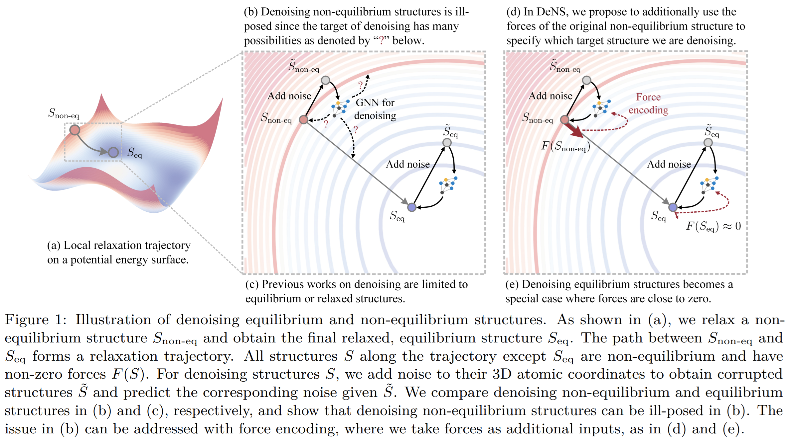
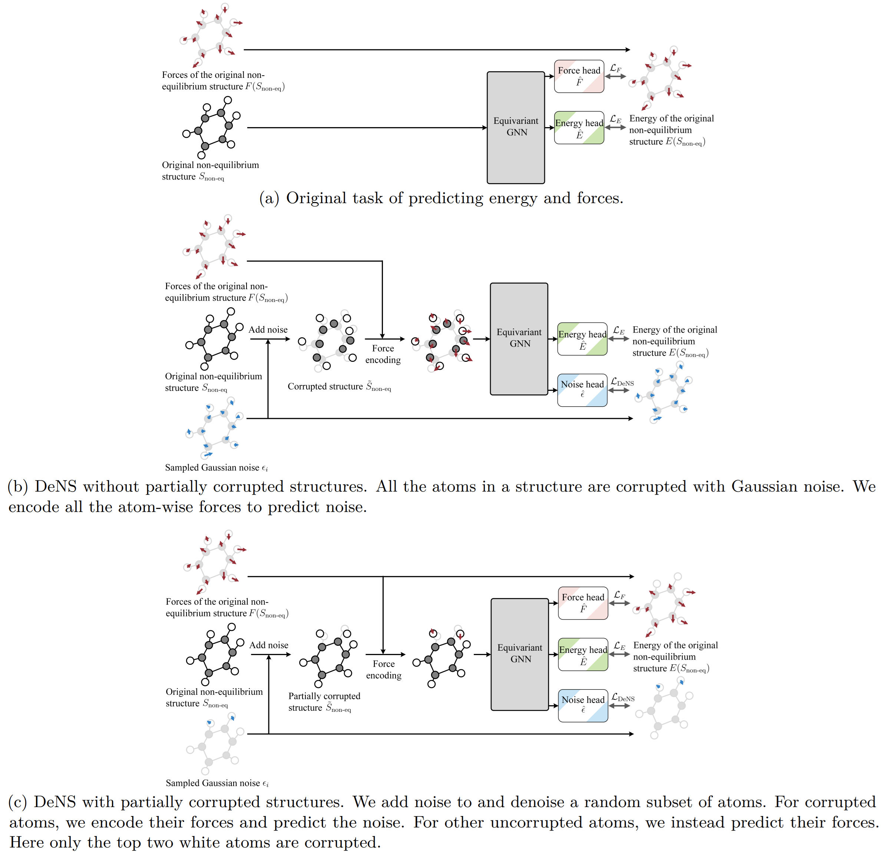
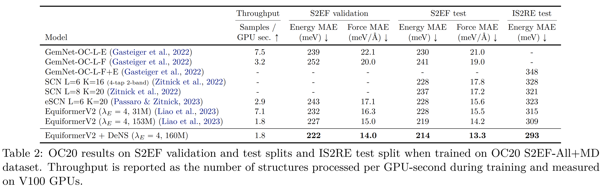
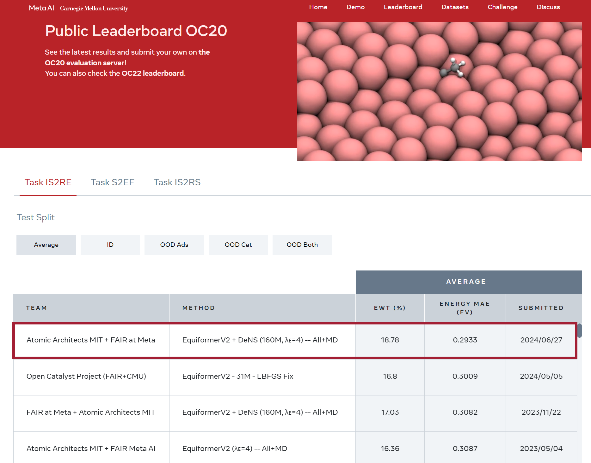
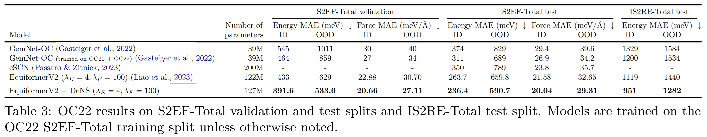
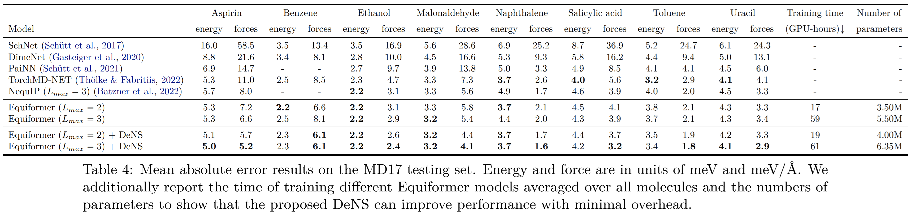

# Generalizing Denoising to Non-Equilibrium Structures Improves Equivariant Force Fields


**[Paper](https://arxiv.org/abs/2403.09549)** | **[OpenReview](https://openreview.net/forum?id=whGzYUbIWA)**


This repository contains the official PyTorch implementation of the work "Generalizing Denoising to Non-Equilibrium Structures Improves Equivariant Force Fields" (TMLR 2024).
We show that force encoding enables generalizing denoising to non-equilibrium structures and propose to use **DeNS** (**De**noising **N**on-Equilibrium **S**tructures) as an auxiliary task to improve the performance on energy and force predictions.

We provide the code for training [EquiformerV2](https://arxiv.org/abs/2306.12059) with DeNS on OC20 and OC22 datasets here and training [Equiformer](https://arxiv.org/abs/2206.11990) with DeNS on MD17 in this [repository](https://github.com/atomicarchitects/equiformer).


<p align="center">
	
</p>

<p align="center">
	
</p>

<p align="center">
	
</p>

<p align="center">
	
</p>

<p align="center">
	
</p>

<p align="center">
	
</p>


As demonstrated in [OMat24](https://arxiv.org/abs/2410.12771) paper, EquiformerV2 + DeNS achieves state-of-the-art results on [Matbench Discovery](https://matbench-discovery.materialsproject.org/) leaderboard as of October 18, 2024.

<p align="center">
	
</p>


## Content ##
0. [Environment Setup](#environment-setup)
0. [File Structure](#file-structure)
0. [Training](#training)
0. [Checkpoint](#checkpoint)
0. [Evaluation](#evaluation)
0. [Citation](#citation)
0. [Acknowledgement](#acknowledgement)


## Environment Setup ##


### Environment 

See [here](docs/env_setup.md) for setting up the environment.


### OC20

Please first set up the environment and file structures (placing this repository under `ocp` and rename it to `experimental`) following the above [Environment](#environment) section.

The OC20 S2EF dataset can be downloaded by following instructions in their [GitHub repository](https://github.com/Open-Catalyst-Project/ocp/blob/5a7738f9aa80b1a9a7e0ca15e33938b4d2557edd/DATASET.md#download-and-preprocess-the-dataset).

For example, we can download the OC20 S2EF-2M dataset by running:
```
    cd ocp
    python scripts/download_data.py --task s2ef --split "2M" --num-workers 8 --ref-energy
```
We also need to download the `"val_id"` data split to run training.

After downloading, the datasets should be under `ocp/data`.

To train on different splits like All and All+MD, we can follow the same link above to download the datasets.


### OC22

Please first set up the environment and file structures (placing this repository under `ocp` and rename it to `experimental`) following the above [Environment](#environment) section.

Similar to OC20, the OC22 dataset can be downloaded by following instructions in their [GitHub repository](https://github.com/FAIR-Chem/fairchem/blob/5a7738f9aa80b1a9a7e0ca15e33938b4d2557edd/DATASET.md#open-catalyst-2022-oc22).


### MD17

Please refer to this [repository](https://github.com/atomicarchitects/equiformer) for training Equiformer with DeNS on MD17.


## File Structure ##

1. [`configs`](configs) contains config files for training with DeNS on different datasets.
2. [`datasets`](datasets) contains LMDB dataset class that can distinguish whether structures in OC20 come from All split or MD split.
3. [`model`](model) contains EquiformerV2 and eSCN models capable of training with DeNS.
4. [`scripts`](scripts) contains the scripts for launching training based on config files.
5. [`trainers`](trainers) contains the code for training models for S2EF and with DeNS.


## Training ##

### OC20

1. Modify the paths to datasets before launching training. For example, we need to modify the path to the training set as [here](configs/oc20/2M/equiformer_v2/equiformer_dens_v2_N%4012_L%406_M%402_lr%402e-4_epochs%4012_std%400.1_gpus%4016.yml#L7) and the validation set as [here](configs/oc20/2M/equiformer_v2/equiformer_dens_v2_N%4012_L%406_M%402_lr%402e-4_epochs%4012_std%400.1_gpus%4016.yml#L20) before training EquiformerV2 with DeNS on OC20 S2EF-2M dataset for 12 epochs.

2. We train EquiformerV2 with DeNS on the **OC20 S2EF-2M dataset** for **12 epochs** by running:
    ```bash
        cd ocp/
        sh experimental/scripts/train/oc20/s2ef/equiformer_v2/equiformer_dens_v2_N@12_L@6_M@2_epochs@12_splits@2M_g@multi-nodes.sh
    ```
    Note that following the above [Environment](#environment) section, we will run the script under `ocp`.
    This script will use 2 nodes with 8 GPUs on each node.
    
    We can also run training on 8 GPUs on 1 node:
    ```bash
        cd ocp/
        sh experimental/scripts/train/oc20/s2ef/equiformer_v2/equiformer_dens_v2_N@12_L@6_M@2_epochs@12_splits@2M_g@8.sh
    ```
    Note that this is to show that we can train on a single node and the results are not the same as training on 16 GPUs.

    Similarly, we train EquiformerV2 with DeNS on the **OC20 S2EF-2M dataset** for **30 epochs** by running:
    ```bash
        cd ocp/
        sh experimental/scripts/train/oc20/s2ef/equiformer_v2/equiformer_dens_v2_N@12_L@6_M@2_epochs@30_splits@2M_g@multi-nodes.sh
    ```
    This script will use 4 nodes with 8 GPUs on each node.

3. We train EquiformerV2 with DeNS on the **OC20 S2EF-All+MD dataset** by running:
    ```bash
        cd ocp/
        sh experimental/scripts/train/oc20/s2ef/equiformer_v2/equiformer_dens_v2_N@20_L@6_M@3_splits@all-md_g@multi-nodes.sh
    ```
    This script will use 16 nodes with 8 GPUs on each node.

    We use a slightly different dataset class `DeNSLmdbDataset` so that we can differentiate whether a structure is from the All split or the MD split.
    This corresponds to the code [here](datasets/dens_lmdb_dataset.py#L92-L108) and requires `relaxations` and `md` to exist in `data_log.*.txt` files under the All+MD data directory.
    Those `data_log.*.txt` should look like:
    ```bash
        # for All split
        /.../relaxations/.../random1331004.traj,258,365
        ...
    ```
    After reading the lmdb files, the `DeNSLmdbDataset` dataset will add a new attribute `md` as [here](datasets/dens_lmdb_dataset.py#L193-L198).


### OC22

1. Modify the paths to datasets before launching training. Specifically, we need to modify the path to the training set as [here](configs/oc22/equiformer_v2/equiformer_v2_dens_N%4018_L%406_M%402_e%404_f%40100_std%400.15.yml#L7) and the validation set as [here](configs/oc22/equiformer_v2/equiformer_v2_dens_N%4018_L%406_M%402_e%404_f%40100_std%400.15.yml#L22). 

    In addition, we need to download the linear reference file from [here](https://github.com/FAIR-Chem/fairchem/tree/be0f727a515582b01e6c51672a08f5b693f015e9/configs/oc22/linref) and then add the path to the linear reference file as [here](configs/oc22/equiformer_v2/equiformer_v2_dens_N%4018_L%406_M%402_e%404_f%40100_std%400.15.yml#L19) and [here](configs/oc22/equiformer_v2/equiformer_v2_dens_N%4018_L%406_M%402_e%404_f%40100_std%400.15.yml#L24). 
    
    Finally, we download the OC20 reference information file from [here](https://github.com/FAIR-Chem/fairchem/blob/be0f727a515582b01e6c51672a08f5b693f015e9/DATASET.md#oc20-reference-information) and add the path to that file as [here](configs/oc22/equiformer_v2/equiformer_v2_dens_N%4018_L%406_M%402_e%404_f%40100_std%400.15.yml#L20) and [here](configs/oc22/equiformer_v2/equiformer_v2_dens_N%4018_L%406_M%402_e%404_f%40100_std%400.15.yml#L25).

2. We train EquiformerV2 with DeNS on OC22 dataset by running:
    ```bash
        cd ocp/
        sh experimental/scripts/train/oc22/s2ef/equiformer_v2/equiformer_dens_v2_N@18_L@6_M@2_epochs@6_g@multi-nodes.sh
    ```
    This script will use 4 nodes with 8 GPUs on each node.


### MD17

Please refer to this [repository](https://github.com/atomicarchitects/equiformer) for training Equiformer with DeNS on MD17.


## Checkpoint ##

We provide the checkpoints of **EquiformerV2 trained with DeNS** on **OC20 S2EF-2M** dataset for 12 and 30 epochs, **OC20 S2EF-All+MD** dataset, and **OC22** dataset.
|Split	|Epochs |Download	|val force MAE (meV / Å) |val energy MAE (meV) |
|---	|---	|---	|---	|---	|
| OC20 S2EF-2M	| 12 |[checkpoint](https://dl.fbaipublicfiles.com/opencatalystproject/models/2024_07/oc20/s2ef/eq2_dens_epochs_12_2M.pt) \| [config](configs/oc20/2M/equiformer_v2/equiformer_dens_v2_N@12_L@6_M@2_lr@2e-4_epochs@12_std@0.1_gpus@16.yml)	| 19.09 | 269 |
| OC20 S2EF-2M	| 30 |[checkpoint](https://dl.fbaipublicfiles.com/opencatalystproject/models/2024_07/oc20/s2ef/eq2_dens_epochs_30_2M.pt) \| [config](configs/oc20/2M/equiformer_v2/equiformer_dens_v2_N@12_L@6_M@2_lr@4e-4_epochs@30_std@0.15_gpus@32.yml)	| 18.02 | 251 |
| OC20 S2EF-All+MD | 2 | [checkpoint](https://dl.fbaipublicfiles.com/opencatalystproject/models/2024_07/oc20/s2ef/eq2_dens_allmd.pt) \| [config](configs/oc20/all-md/equiformer_v2/equiformer_v2_dens_N@20_L@6_M@3_lr@4e-4_epochs@2_std@0.1_dens-relax-data-only.yml) | 14.0 | 222 |
| OC22 | 6 | [checkpoint](https://dl.fbaipublicfiles.com/opencatalystproject/models/2024_07/oc22/s2ef/eq2_dens_oc22.pt) \| [config](configs/oc22/equiformer_v2/equiformer_v2_dens_N@18_L@6_M@2_e@4_f@100_std@0.15.yml) | (ID) 20.66 \| (OOD) 27.11 | (ID) 391.6 \| (OOD) 533.0 |


## Evaluation ##

We provide the evaluation script on OC20 and OC22 datasets.
After following the above [Environment](#environment) section and downloading the checkpoints [here](#checkpoint), we run the [script](scripts/evaluate/oc20/s2ef/equiformer_v2/equiformer_dens_v2_N%4012_L%406_M%402_epochs%4012_splits%402M_g%40multi-nodes.sh) to evaluate the results on validation sets.

For instance, after updating the path to the validation set as [here](configs/oc20/2M/equiformer_v2/equiformer_dens_v2_N%4012_L%406_M%402_lr%402e-4_epochs%4012_std%400.1_gpus%4016.yml#L20) and `CHECKPOINT` as [here](scripts/evaluate/oc20/s2ef/equiformer_v2/equiformer_dens_v2_N%4012_L%406_M%402_epochs%4012_splits%402M_g%40multi-nodes.sh#L1), we evaluate the result of EquiformerV2 trained on OC20 S2EF-2M dataset for 12 epochs by running: 
```bash
    cp ocp/
    sh experimental/scripts/evaluate/oc20/s2ef/equiformer_v2/equiformer_dens_v2_N@12_L@6_M@2_epochs@12_splits@2M_g@multi-nodes.sh
```

We can update the path in the config file to evaluate on different validation sub-splits and use different config files to evaluate different models.


## Citation ##

Please consider citing the works below if this repository is helpful:

- [DeNS](https://arxiv.org/abs/2403.09549):
    ```bibtex
    @article{
        DeNS,
        title={Generalizing Denoising to Non-Equilibrium Structures Improves Equivariant Force Fields}, 
        author={Yi-Lun Liao and Tess Smidt and Muhammed Shuaibi* and Abhishek Das*},
        journal={arXiv preprint arXiv:2403.09549},
        year={2024}
    }
    ```

- [EquiformerV2](https://arxiv.org/abs/2306.12059):
    ```bibtex
    @inproceedings{
        equiformer_v2,
        title={{EquiformerV2: Improved Equivariant Transformer for Scaling to Higher-Degree Representations}}, 
        author={Yi-Lun Liao and Brandon Wood and Abhishek Das* and Tess Smidt*},
        booktitle={International Conference on Learning Representations (ICLR)},
        year={2024},
        url={https://openreview.net/forum?id=mCOBKZmrzD}
    }
    ```

- [Equiformer](https://arxiv.org/abs/2206.11990):
    ```bibtex
    @inproceedings{
        equiformer,
        title={{Equiformer: Equivariant Graph Attention Transformer for 3D Atomistic Graphs}},
        author={Yi-Lun Liao and Tess Smidt},
        booktitle={International Conference on Learning Representations (ICLR)},
        year={2023},
        url={https://openreview.net/forum?id=KwmPfARgOTD}
    }
    ```

Please direct questions to Yi-Lun Liao (ylliao@mit.edu).


## Acknowledgement ##

Our implementation is based on [PyTorch](https://pytorch.org/), [PyG](https://pytorch-geometric.readthedocs.io/en/latest/index.html), [e3nn](https://github.com/e3nn/e3nn), [timm](https://github.com/huggingface/pytorch-image-models), [ocp](https://github.com/Open-Catalyst-Project/ocp), [Equiformer](https://github.com/atomicarchitects/equiformer), and [EquiformerV2](https://github.com/atomicarchitects/equiformer_v2).